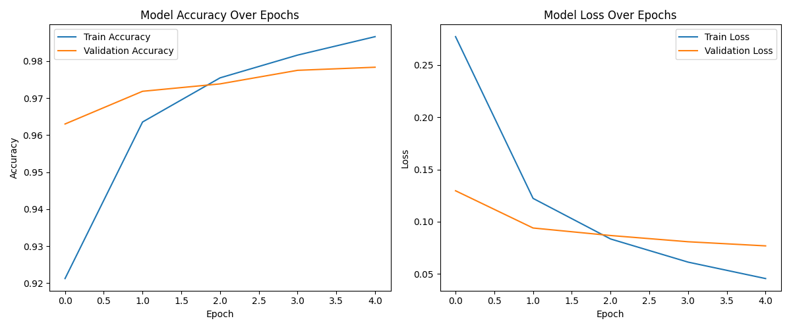
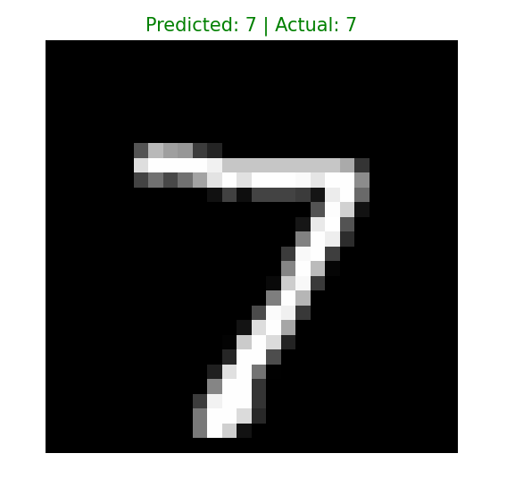

# 🧠 Deep Learning Task - 2 (CodTech Internship)

*COMPANY*: CODTECH IT SOLUTIONS

*NAME*: WUNA AKHILESH

*INTERN ID*: CT04DF985

*DOMAIN*: DATA SCIENCE

*DURATION*: 4 WEEKS

*MENTOR*: NEELA SANTHOSH KUMAR


## ✅ Objective
Build a deep learning model for **image classification** using **TensorFlow** on the MNIST handwritten digit dataset.

---

## 📂 Dataset: MNIST Handwritten Digits
- 60,000 training images  
- 10,000 test images  
- Grayscale format (28x28 pixels)  
- 10 classes (digits from 0 to 9)

---

## 🧠 Model Architecture
**Input:** 28x28 image  
→ `Flatten`  
→ `Dense(128, activation='relu')`  
→ `Dense(10, activation='softmax')`

- **Flatten**: Converts 2D image to 1D vector  
- **Dense (128, ReLU)**: Fully connected hidden layer  
- **Dense (10, Softmax)**: Output layer for digit classification

---

## 📁 Project Files

| File | Description |
|------|-------------|
| `model.py` | Trains the model, evaluates performance, and plots accuracy/loss graph |
| `visualize.py` | Loads the trained model and visualizes predictions |
| `mnist_model.h5` | Saved trained model |
| `training_results.png` | Accuracy/Loss graph saved as image |

---

## ▶️ How to Run

### 1️⃣ Train the Model
```bash
python model.py
```

---

2️⃣ Visualize Predictions
```bash
python visualize.py
```

---

⚙️ Dependencies
Install required packages using pip:
```bash
pip install tensorflow matplotlib
```
---

## 🖼️ Sample Outputs

### 🔹 Training Accuracy & Loss Graph


### 🔹 Sample Predictions

